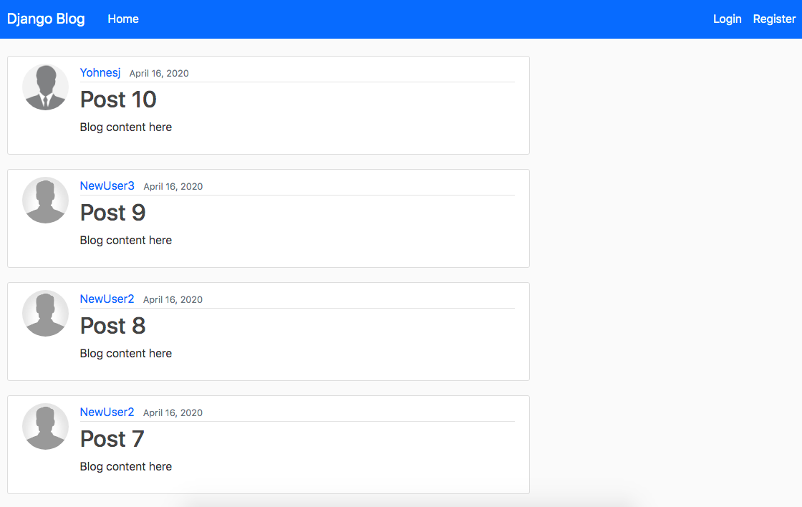

# Blog Website
A blog style web application using django that allows you to create an account, login, reset your password, update profile information, update profile picture, post to the homepage, update and delete posts.  

# What I Learned

+ Using django's authintacation system
+ Parent Templates
+ Route paths using views and urls modules
+ Working with parent and child templates
+ Create and manage admin user 
+ Class based models
+ Database and migrations
+ Pagination
+ Creating inherited forms 
+ Form validation and authentication

